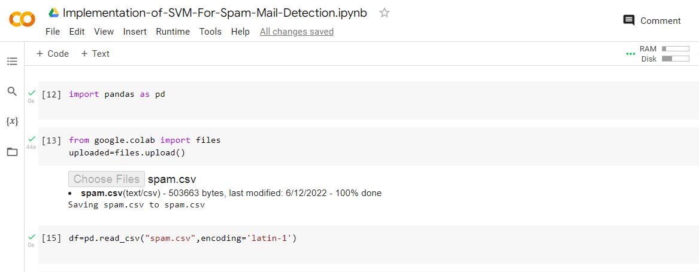
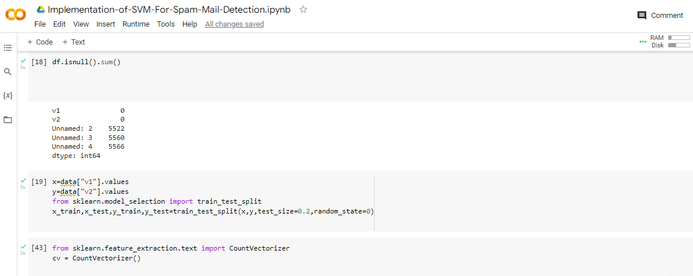
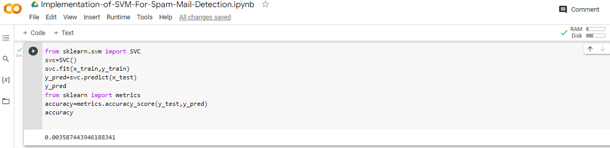

# Implementation-of-SVM-For-Spam-Mail-Detection

## AIM:
To write a program to implement the SVM For Spam Mail Detection.

## Equipments Required:
1. Hardware – PCs
2. Anaconda – Python 3.7 Installation / Moodle-Code Runner

## Algorithm
1. Import the necessary packages using import statement.

2. Read the given csv file and print the number of contents to be displayed.

3. Split the dataset using train_test_split.

4. Calculate Y_Pred and accuracy.

5. Display the result.


## Program:
```

Program to implement the SVM For Spam Mail Detection..
Developed by: silambarsan K
RegisterNumber:  212221230101

import pandas as pd
data=pd.read_csv("spam.csv",encoding='latin-1')
data.head()
data.info()
data.isnull().sum()
x=data["EmailText"].values
y=data["Label"].values
from sklearn.model_selection import train_test_split 
x_train,x_test,y_train,y_test=train_test_split(x,y,test_size=0.2,random_state=0)
from sklearn.feature_extraction.text import CountVectorizer
cv=CountVectorizer()
x_train=cv.fit_transform(x_train)
x_test=cv.transform(x_test)
from sklearn.svm import SVC
svc=SVC()
svc.fit(x_train,y_train)
y_pred=svc.predict(x_test)
y_pred
from sklearn import metrics
accuracy=metrics.accuracy_score(y_test,y_pred)
accuracy

```

## Output:






## Result:
Thus the program to implement the SVM For Spam Mail Detection is written and verified using python programming.
